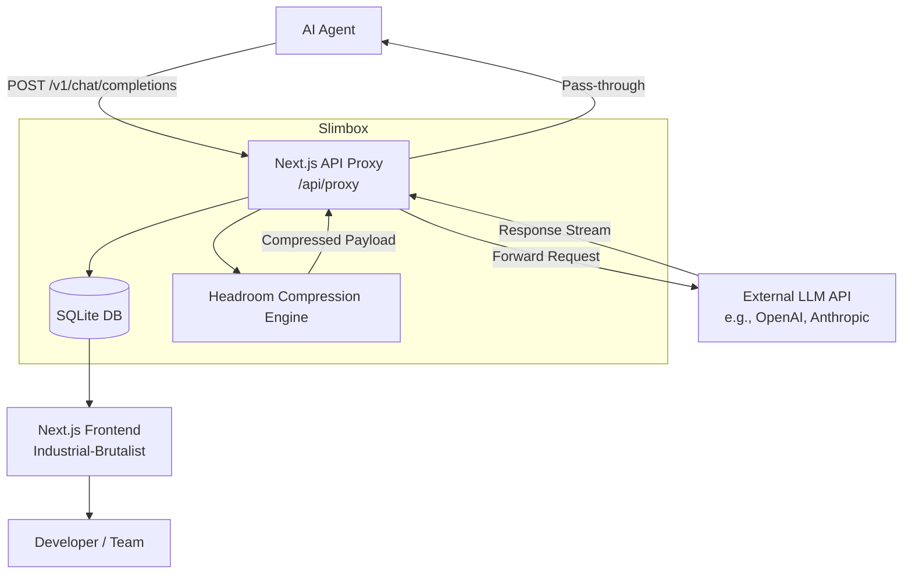

# Slimbox Architecture

```mermaid
flowchart TD
    Agent[AI Agent] -->|POST /v1/chat/completions| Proxy[Next.js API Proxy\n/api/proxy]
    
    subgraph Slimbox
        Proxy --> DB[(SQLite DB)]
        Proxy --> Headroom[Headroom Compression Engine]
        Headroom -->|Compressed Payload| Proxy
    end
    
    Proxy -->|Forward Request| LLM[External LLM API\ne.g., OpenAI, Anthropic]
    LLM -->|Response Stream| Proxy
    Proxy -->|Pass-through| Agent
    
    DB --> Dashboard[Next.js Frontend\nIndustrial-Brutalist]
    Dashboard --> User[Developer / Team]
```
